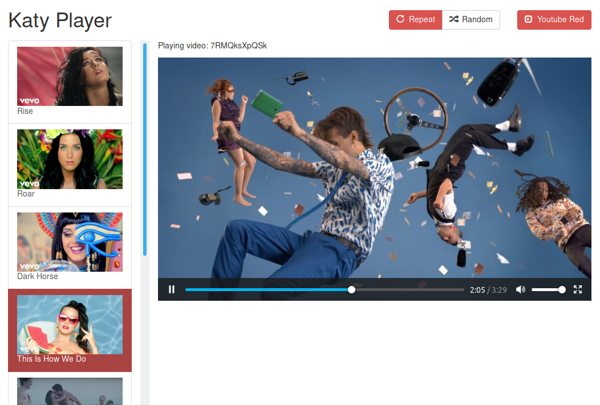

# Katy Player

Media player for Michael's favorite Katy Perry videos.

Winner of [CoderRadio's Katy Perry coding challenge](https://www.reddit.com/r/CoderRadio/comments/4ukt4k/episode_215_coding_challenge/)



## Features

* Play all videos in a row, randomly or in *Repeat*
* Fake YouTube ads for Jupiter Broadcasting
* YouTube Red support based on *trust*

## How to use

### Using docker and docker-compose
Clone the repository and run
```
docker-compose up
```
Then open a browser on [http://localhost:3000](http://localhost:3000)

If docker doesn't expose ports on localhost, you need to change the URL accordingly in `config.json` and rebuild the docker images:
```
docker-compose up --build
```

### Using the pre-built bundle
* Install `python3` if you don't have it already
* Download and extract [this pre-built bundle](https://github.com/simonbru/katy-player/releases/download/0.1/bundle.tar.gz)
* Run the youtube-dl bridge: `python3 bundle/api_server/server.py`
* Run a simple web server for the client app, e.g.: `cd bundle/app && python3 -m http.server 3000`
* Open a browser on [http://localhost:3000](http://localhost:3000)
